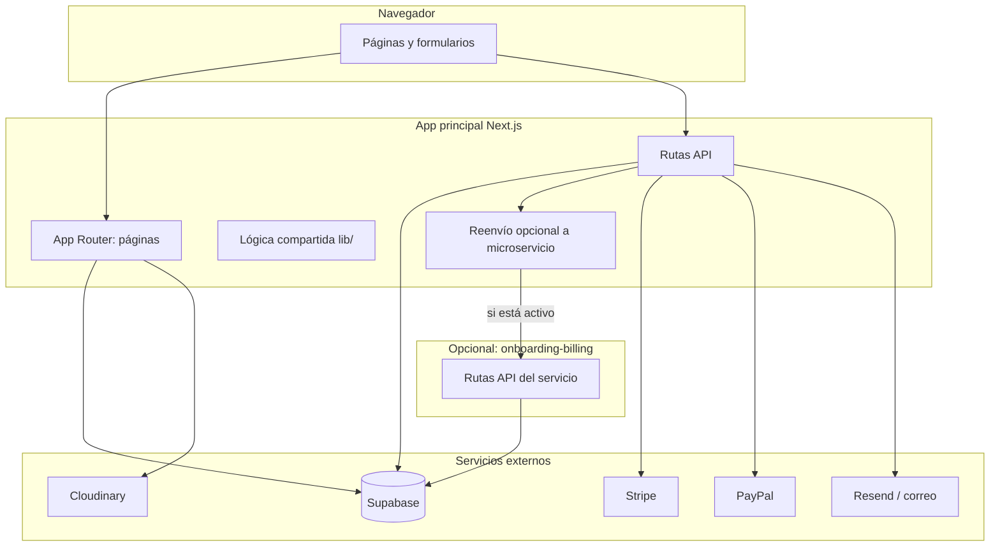

# Arquitectura del proyecto (saas-godcode-admin)

Documento complementario a la explicación en lenguaje general. Aquí se describe **cómo está organizado el sistema**, qué piezas hablan entre sí y qué decisiones de diseño se observan en el repositorio.

---

## 1. Vista general

El sistema es una **aplicación web full-stack** (interfaz + lógica en servidor en el mismo proyecto) con **multi-tenant por subdominio**. La **persistencia y la autenticación** viven principalmente en **Supabase** (base de datos + auth + políticas de acceso). Los **pagos y correos** se apoyan en **servicios externos** cuando están configurados.

En el mismo monorepo existe un **segundo despliegue opcional**: el servicio `onboarding-billing`, que puede asumir parte del flujo de alta y cobro. La aplicación principal puede **delegar** en él mediante un patrón tipo **BFF** (Backend-for-Frontend): las rutas de API del proyecto principal **reenvían** la petición al microservicio según una **bandera de configuración**, o ejecutan la lógica local si la delegación está desactivada.

---

## 2. Capas lógicas (dentro de la app principal)

| Capa | Ubicación típica | Rol |
|------|------------------|-----|
| **Presentación** | `app/**` (páginas), `components/**` | Qué ve el usuario y eventos de UI. |
| **Orquestación servidor** | `app/**` (servidor en páginas), `app/api/**` | Sesión, redirecciones, validación previa, llamadas a datos. |
| **Acceso a datos y reglas de app** | `utils/supabase/*`, `lib/*`, consultas en rutas | Clientes Supabase con **ámbito** distinto para super admin vs tenant. |
| **Integraciones** | Rutas API, `lib/onboarding/*` | Pagos, correos, reCAPTCHA, etc. |

No hay una capa “API REST” separada en otro lenguaje: las **API routes** de Next.js son el borde HTTP del backend embebido.

---

## 3. Multi-tenant: cómo se parte el mundo

- **Identificador público del negocio** (slug) se alinea con el **subdominio** respecto al dominio base configurado.
- **Super admin**: usuarios en tabla dedicada de administradores; sesión y consultas orientadas al panel central.
- **Tenant**: usuarios vinculados a una **empresa** (`company_id`) y **rol**; el panel del negocio y muchas APIs comprueban que la sesión corresponda a esa empresa.

Los datos comparten **un mismo proyecto Supabase**; el aislamiento depende de **modelo de datos + políticas (RLS)** y de **comprobaciones en servidor**, no de una base de datos física por cliente.

---

## 4. Tres superficies de producto (rutas)

1. **Dominio principal**: login super admin, dashboard, empresas, planes, tickets, onboarding público, checkout.
2. **Rutas bajo “subdominio” en path** (`/[slug]/...`): home del negocio, menú, login tenant, panel admin del negocio (en producción el path suele alinearse con el host vía configuración de despliegue o reglas de enrutamiento).
3. **API bajo `/api`**: JSON y acciones para formularios, paneles y tareas programadas.

---

## 5. Microservicio onboarding-billing

- **Qué es**: otra aplicación Next.js más pequeña, carpeta `services/onboarding-billing`, con sus propias rutas de API (onboarding, salud, cron de suscripciones, validación de pagos para super admin, etc.).
- **Por qué existe**: separar **escalado, despliegue y límites** del flujo de alta y facturación respecto al panel grande.
- **Cómo se conecta**: variable de entorno con la URL base del servicio, clave interna para peticiones servidor-a-servidor, y modo de operación (`off` / reenvío con fallback local / solo proxy). La app principal **repite la ruta** en el servicio remoto cuando corresponde.

Riesgo de arquitectura: **duplicación de lógica** entre ambos lados si no se mantiene un criterio claro de “fuente de verdad” y despliegues coordinados.

---

## 6. Sistema de autenticación y sesión (conceptual)

- **Supabase Auth** emite la sesión del usuario.
- El código distingue **ámbitos** de cliente: **super-admin** vs **tenant** (cookies / alcance de sesión según zona), para que las operaciones no mezclen contextos indebidos.

---

## 7. Dependencias externas (arquitectura de integración)

| Servicio | Función en el sistema |
|----------|------------------------|
| **Supabase** | Auth, datos, políticas. |
| **Stripe / PayPal** | Cobro en onboarding y métodos de pago. |
| **Resend (+ Nodemailer en stack)** | Correos transaccionales. |
| **Cloudinary** | Imágenes y subidas desde UI. |
| **reCAPTCHA** | Abuso en formularios de onboarding. |

Si falta una integración, suele **degradarse** esa función, no necesariamente toda la app (según ruta y validación de entorno).

---

## 8. Calidad, build y exclusiones

- **TypeScript** en gran parte del panel principal; el **kit admin del tenant** incluye mucho **JavaScript** heredado: dos estilos en convivencia.
- **ESLint** y **Vitest** para calidad y pruebas puntuales (p. ej. comportamiento del reenvío al microservicio).
- **Build**: se excluyen del tipado ciertas carpetas (`supabase-functions-backup`, etc.) para no mezclar entornos con el compilador de la app web.

---

## 9. Puntos ambiguos o pendientes de cerrar en el repo

- En la **raíz de la app principal** existe `proxy.ts` con lógica de subdominio, pero **no hay `middleware.ts`** en esa raíz enlazado de forma estándar. El enrutamiento real en producción puede depender de **reglas en Vercel (u otro host)** además de la página inicial que redirige. Conviene documentar en el equipo **la fuente de verdad** del mapeo host → ruta.
- La rama y el historial sugieren **refactor hacia microservicios**; la arquitectura actual es **híbrida** (monolito Next + servicio opcional), no puramente microservicios en todo el dominio.

---

## 10. Resumen en una frase

**Monolito Next.js multi-tenant** con datos y auth en **Supabase**, integraciones de pago y correo, y un **microservicio opcional** para onboarding y billing conectado por **reenvío HTTP configurable** y clave interna.

---

*Relacionado: `docs/explicacion-proyecto-para-no-programadores.md` (visión de negocio y flujos sin detalle técnico).*
